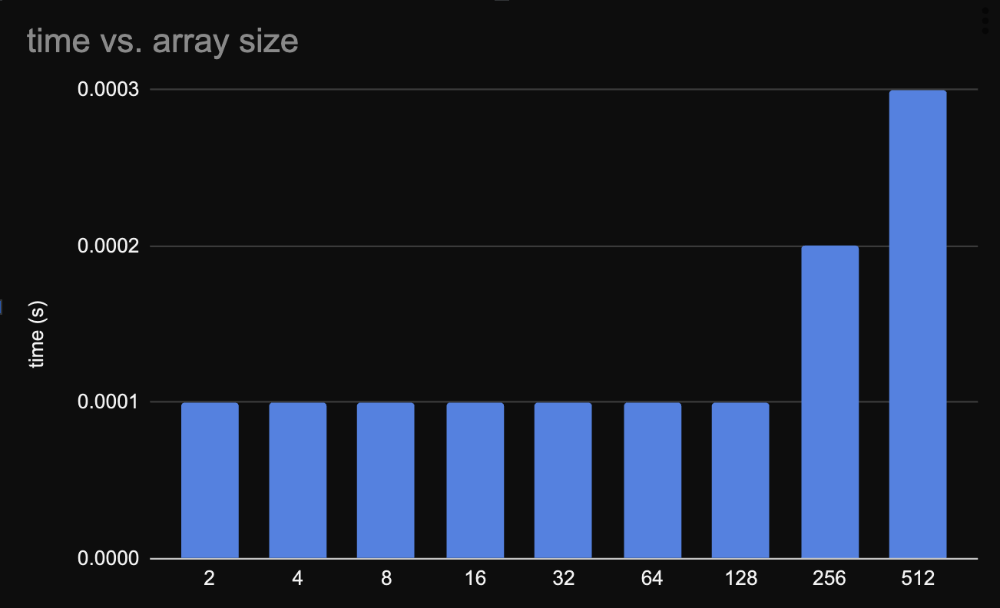
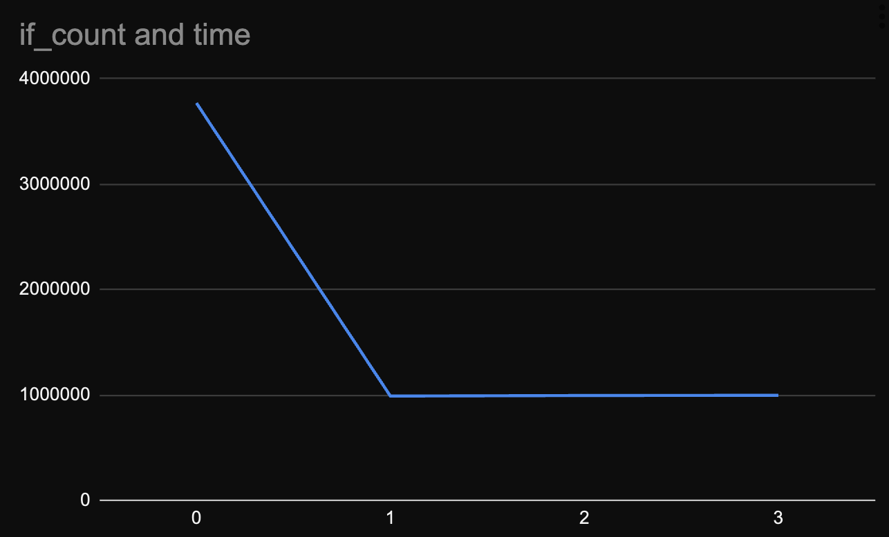
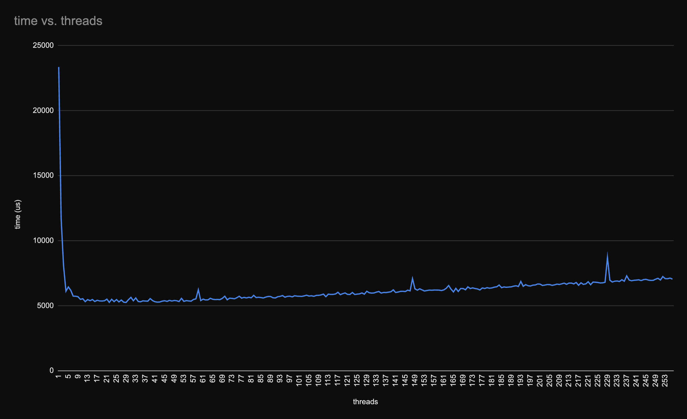
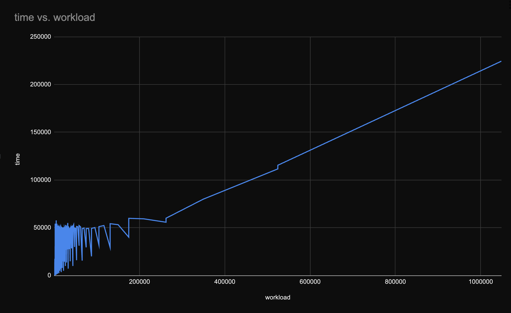
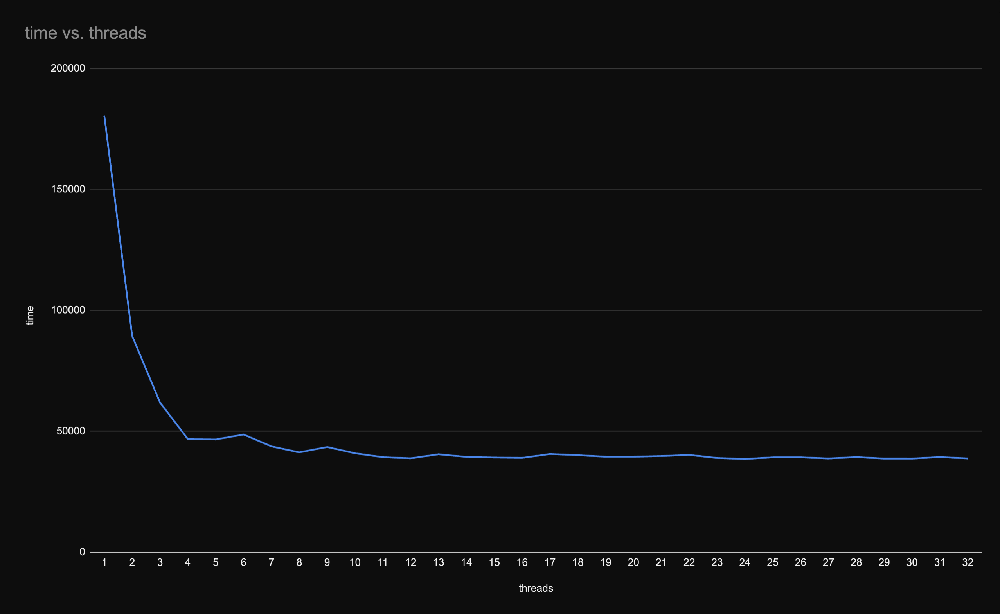
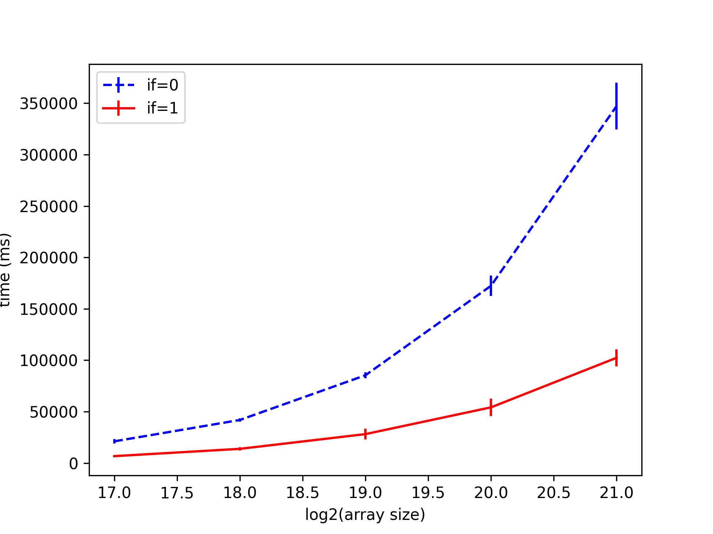

## Isabella Basso - 11810773

# Mini EP 7

In order to automate data collection we wrote a small Python script that
generates a CSV file with the data we need. The script is called `collect.py`.

We notice that, due to formatting, there isn't enough precision to measure
results accurately (see Figure 1).



Thus, we decide to change the code to use the `tv_usec` field of the `timeval`
struct. Now, notice how IF > 1 makes no difference in the results (see Figure
2).



Looking at the macro definition for `IF_GT_MAX`, which is placed N times at
line 69 as we set IF=N, we see that it is defined as:

```c
#define IF_GT_MAX if(t->arr[i] > max)
```

Then, looking at the code near line 69, for IF=1 we should have

```c
if(t->arr[i] > max)
{
        pthread_mutex_lock(&lock);
        if (t->arr[i] > max)
                max = t->arr[i];
        pthread_mutex_unlock(&lock);
}
```

and indeed, commenting the `rm`` command from the Makefile we can see that the
resulting source code is the same as the one above.

For `IF=0` we know that the only way to check the max value is by acquiring the
lock, thus we have lots of waiting time (contention!).
Now, for `IF=1` we have a "redundant" check outside of the critical section.
This redundancy ends up being faster as we cut a lot of waiting time for the
lock while we only perform a lot check in the thread cache.
Of course, for N > 1 we have the same redundancy but it doesn't make a
difference as only a very large amount of (non-compiler optimized) checks would
make a difference.

Now we look for different numbers of threads, and notice that for smaller
values, closer to the number of cores, we have better performance (see Figure
3).



Notice also that for small workloads (ratio of array size/threads) we still
have statistically insignificant results, thus we try to keep that ratio high
(see Figure 4).



Now that we have less noise, we can see that the best performance is achieved
for 8 threads, which is the number of cores in our machine (no hyperthreading)
(see Figure 5).



Now we plot the errors for IF=0 and IF=1 and some values of N (see Figure 6).


